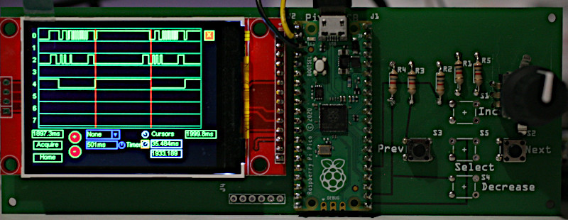
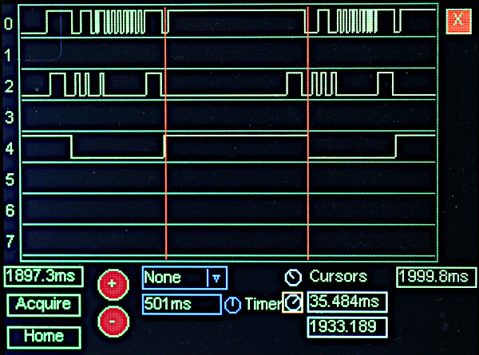

# Displaying monitor information

The monitor project enables the study of running realtime systems with ways of
triggering on infrequent fault conditions. Up to now it has required a logic
analyser or a scope (preferably with more than two channels) to display the
results.

This alternative back-end uses a Pico and an inexpensive display to show up to
eight data channels. Component cost should be under $20. This solution has no
benefits compared to a logic analyser with pre-trigger data capture: it is a
low-cost alternative.



The device under test runs `monitor.py` as per the docs.

Key features are:
 1. Flexible triggering options allow detection of rare events in a realtime
 system including slow running code or CPU hogging.
 2. Substantial data capture pre- and post-tigger enabling the circumstances
 leading to the trigger event to be studied.
 3. Timing measurements may be made using a pair of cursors.
 4. Data may be sideways-scrolled using the encoder.
 5. Zoom in and out buttons.

Limitations:
 1. No realtime display: the device captures a set of samples which may then be
 displayed.
 2. Timing measurements are relatively imprecise (tens of μs).

User interface:  


This shows a capture of data from a realtime system with two measurement
cursors visible.

# Project status

I developed this from a sense of curiosity as to whether it could be done on a
Pico. It works but with some rough edges around the user interface. I remain
unconvinced if it has any practical application: its only merit compared with a
logic analyser is low cost. Saleae clones can be bought cheaply however the
example I have cannot display pre-trigger information making it almost useless.
If a device crashes you want to see events in the run-up to the crash. This
project does provide pre-trigger data. A genuine Saleae is a highly capable
device - if you can justfy the cost.

I don't intend to put any more effort into this unless serious interest is
expressed.

# Hardware

The display is a 2.4" 320x240 ILI9341 unit from eBay. A Pico, two pushbuttons,
and an incremental encoder with pushbutton complete the unit. Wiring is as
below. Power is via USB to the Pico.

| Pin | GPIO | Signal  | Device  |
|:---:|:----:|:-------:|:-------:|
|  9  |  6   | Sck     | Display |
| 10  |  7   | Mosi    |  "      |
| 11  |  8   | d/c     |  "      |
| 12  |  9   | Rst     |  "      |
| 13  | Gnd  | Gnd     |  "      |
| 14  | 10   | cs/     |  "      |
| 36  | 3V3  | V+      |  "      |
| 21  | 16   | Select  | Button  |
| 22  | 17   | X       | Encoder |
| 24  | 18   | Prev    | Button  |
| 25  | 19   | Next    | Button  |
| 26  | 20   | Y       | Encoder |

Pushbuttons and encoder are connected to Gnd. I use 1KΩ pullups to 3.3V but you
may use the internal pin pullups. In my example the Select button is
incorporated in the encoder as a push to select button.

## UART connection

Wiring:

| DUT | GPIO | Pin |
|:---:|:----:|:---:|
| Gnd | Gnd  |  3  |
| txd | 1    |  2  |


## SPI connection

Wiring:

|  DUT  | GPIO | Pin |
|:-----:|:----:|:---:|
| Gnd   | Gnd  |  3  |
| mosi  | 0    |  1  |
| sck   | 1    |  2  |
| cs    | 2    |  4  |

# Installation

The first step is to install micro gui according to
[the docs](https://github.com/peterhinch/micropython-micro-gui). Copy
`hardware_setup.py` and `analyser.py` from the `analyser` directory to the root
of the Pico's filesystem. Run one or more micro gui test scripts and verify
that the buttons and encoder work correctly. The module can be tested with
simulated data by issuing the following at the REPL:

```
import analyser
analyser.run()
```

## Running

The `run` command takes one optional arg:  

`device="demo"` Alternatively "spi" or "uart". In demo mode it generates
synthetic random data, otherwise expects data on the specified interface.

# GUI guide

The analyser operates in two modes: acquisition and display. When the `acquire`
button is pressed it enters acquisition mode and the GUI becomes inoperative.
When a trigger condition occurs it enters display mode and the data may be
examined.

## Main window

When this has focus (white border) the data may be scrolled horizontally with
the encoder. A long press on the encoder changes the border to yellow and gives
finer control. Pressing the `Home` button centres visible data on the trigger.
Individual signals may have values 0, 1 or unknown: the state of a signal is
regarded as unknown until a value arrives from the DUT. This convention causes
unused signals to appear blank improving the clarity of the display. It also
enables determination of the arrival time of the first messaged from the DUT.

## Zoom

The main window may be zoomed using the `+` and `-` buttons. The labels
immediately beneath the main window indicate the start and end times of the
visible data. These are in ms relative to the first event in the buffer.

There is a limit to zooming out, at which point the `-` button will become
greyed-out and unavailable.

## Acquisition and Triggering

Trigger conditions are associated with channel 0.

When the `Acquire` button is pressed, incoming events are buffered until either
a trigger condition occurs or the `Next` physical button is pressed. Thus `Next`
can always be used to terminate acquisition. The buffer is a circular buffer
holding a maximum of 2K events.

When a trigger condition occurs, further data is acquired for 1 second or until
another half a buffer of data arrives (whichever occurs first). This ensures
that half a buffer full of pre-trigger data is retained.

Trigger condions are selected by the dropdown and are as follows:

 1. "Next" Data is acquired until the `Next` hardware button is pressed.
 2. "Ch 0" Trigger if a high level on channel 0 exceeds the duration of the
 timer.
 3. "Timer" Trigger if no event occurs on channel 0 for a period exceeding the
 timer duration.
 4. "Hog end" Trigger if no event occurs on channel 0 for a period exceeding
 the timer duration, but only when activity restarts. The trigger point is the
 first event after the period of inactivity.

Modes 3 and 4 are primarily intended for the detection of CPU hogging where
channel 0 on the DUT runs the `hog_detect` task. Mode 3 is particularly useful
to detect long durations of hogging or crashing. Typical use of mode 2 is where
the DUT runs the `trigger` closure to detect sections of slow running code.

The trigger point is indicated by a vertical blue line in the main window. The
display may be centred on this by pressing the `Home` button.

## Timer

Triggering is controlled by a timer controlled by an `Adjuster` widget to the
right of the timer `Label`. When it has the focus (white border) it is
controlled by the encoder. Fine control may be achieved with a long press on
`Select` when the border turns yellow. Times are in ms in the range 1-1001.

## Cursors

Two cursors may be created, marked by vertical red lines in the main window.
These facilitate "absolute" and relative time measurements. Absolute times are
with reference to the arbitrary start used in the labels below the main screen.
Times are in ms. Accuracy is on the order of tens of μs.

The cursor `Adjuster` widgets can perform fine control as per the Timer one
above.
